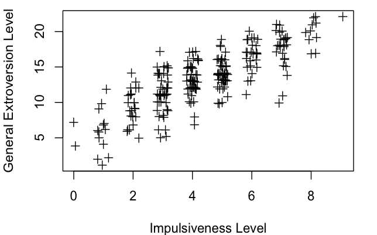
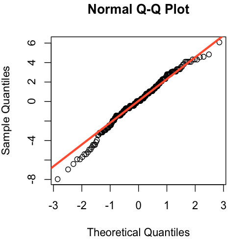
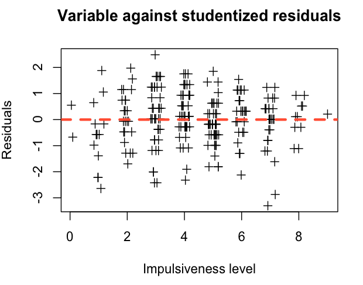
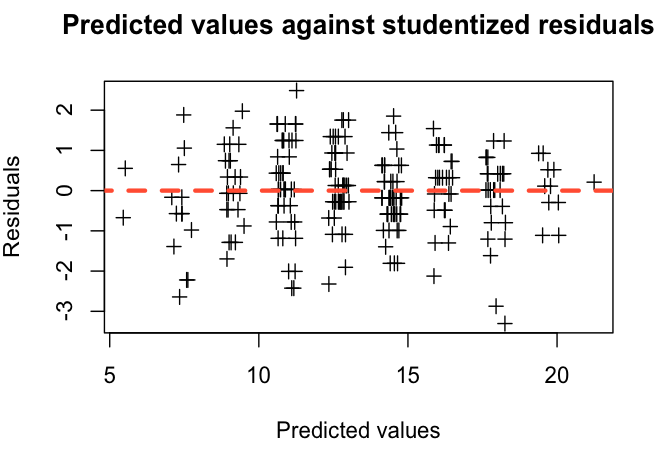
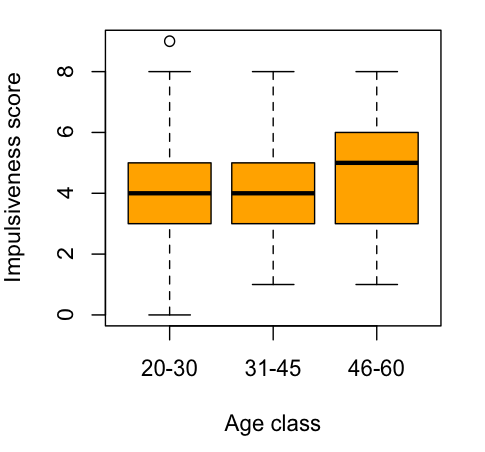

# Statistical inference applied on EPI, BF and BDI scores

## Getting started

### Loading the data

To load the dataset into R :

```r
  data <- read.csv(file="epi-bf-bdi-data.csv",head=T, sep="\t")
```

- `read.csv` Loads the file content into R
- `file` : Path to the file
- `head = T` : Tells R that there is a headline
- `sep = "\t"` : Tells R that values are separated by tabs

We can assert that the file was successfully read with `names` :

```r
  > names(data)
  [1] "epiE"     "epiS"     "epiImp"   "epilie"   "epiNeur"  "bfagree"  "bfcon"
  [8] "bfext"    "bfneur"   "bfopen"   "bdi"      "traitanx" "stateanx" "sex"
  [15] "age"
```

We then use `attach` to facilitate access to the vectors inside the dataframe.

```r
  > attach(data)
```

To see how big the dataset is, we use `dim` :

```r
  > dim(data)
  [1] 231  15
```

We thus have 231 results for fifteen variables.

### Overview of the dataset

```r
  > summary(data)
        epiE            epiS            epiImp          epilie     
   Min.   : 1.00   Min.   : 0.000   Min.   :0.000   Min.   :0.000  
   1st Qu.:11.00   1st Qu.: 6.000   1st Qu.:3.000   1st Qu.:1.000  
   Median :14.00   Median : 8.000   Median :4.000   Median :2.000  
   Mean   :13.33   Mean   : 7.584   Mean   :4.368   Mean   :2.377  
   3rd Qu.:16.00   3rd Qu.: 9.500   3rd Qu.:6.000   3rd Qu.:3.000  
   Max.   :22.00   Max.   :13.000   Max.   :9.000   Max.   :7.000  
      epiNeur         bfagree          bfcon           bfext      
   Min.   : 0.00   Min.   : 74.0   Min.   : 53.0   Min.   :  8.0  
   1st Qu.: 7.00   1st Qu.:112.0   1st Qu.: 99.0   1st Qu.: 87.5  
   Median :10.00   Median :126.0   Median :114.0   Median :104.0  
   Mean   :10.41   Mean   :125.0   Mean   :113.3   Mean   :102.2  
   3rd Qu.:14.00   3rd Qu.:136.5   3rd Qu.:128.5   3rd Qu.:118.0  
   Max.   :23.00   Max.   :167.0   Max.   :178.0   Max.   :168.0  
       bfneur           bfopen           bdi            traitanx    
   Min.   : 34.00   Min.   : 73.0   Min.   : 0.000   Min.   :22.00  
   1st Qu.: 70.00   1st Qu.:110.0   1st Qu.: 3.000   1st Qu.:32.00  
   Median : 90.00   Median :125.0   Median : 6.000   Median :38.00  
   Mean   : 87.97   Mean   :123.4   Mean   : 6.779   Mean   :39.01  
   3rd Qu.:104.00   3rd Qu.:136.5   3rd Qu.: 9.000   3rd Qu.:44.00  
   Max.   :152.00   Max.   :173.0   Max.   :27.000   Max.   :71.00  
      stateanx     sex        age    
   Min.   :21.00   F:119   20-30:66  
   1st Qu.:32.00   H:112   31-45:88  
   Median :38.00           46-60:77  
   Mean   :39.85                     
   3rd Qu.:46.50                     
   Max.   :79.00 
```

## Fitting linear models

We want to analyze the relation between impulsiveness and general extroversion levels, both evaluated by the EPI test. We will analyze the link between the two variables with the following linear model :

> Y = α + βX + ε

Where :

> Extroversion = α + β x Impulsiveness + ε

### Visualization

We first visualize the data with a scatterplot :

```r
  > plot(jitter(epiImp), jitter(epiE), xlab="Impulsiveness Level", ylab="General Extroversion Level", pch=3)
```



With the help of the scatterplot's shape, we can infer that there is a linear relationship between impulsiveness and extroversion levels.

### Creating a linear model

We now proceed towards a more thorough analysis by creating a linear model with `lm`.

```r
  > mod <- lm(epiE~epiImp)
  > summary(mod)

  Call:
  lm(formula = epiE ~ epiImp)

  Residuals:
      Min      1Q  Median      3Q     Max 
  -7.9657 -1.4457  0.0743  1.5743  6.0743 

  Coefficients:
              Estimate Std. Error t value Pr(>|t|)    
  (Intercept)  5.64574    0.41262   13.68   <2e-16 ***
  epiImp       1.75999    0.08677   20.28   <2e-16 ***
  ---
  Signif. codes:  0 ‘***’ 0.001 ‘**’ 0.01 ‘*’ 0.05 ‘.’ 0.1 ‘ ’ 1 

  Residual standard error: 2.478 on 229 degrees of freedom
  Multiple R-squared: 0.6424, Adjusted R-squared: 0.6408 
  F-statistic: 411.4 on 1 and 229 DF,  p-value: < 2.2e-16 
```

Signifiance tests for our two variables (Intercept and epiImp) give probabilities under the usual 5% threshold, we can thus rewrite our linear model:

> Extroversion = 5,6 + 1,8 x Impulsiveness + ε

With 64% for R², 64% of the impulsiveness levels explain the extroversion level.

### Validity of the analysis

We'll test:

- Mean of 0 for the residuals
- Gaussian distribution for the residuals
- Constant variance.

#### Mean of 0 for the residuals

```r
  > mean(mod$residuals)
  [1] -2.437624e-17
```

####  Gaussian distribution

We will plot the quantiles-quantiles graph with the bisector for the ideal alignment.

```r
  > qqnorm(mod$residuals)
  > qqline(mod$residuals,col="tomato",lwd=3)
```



Residuals are aligned to the bisector, their distribution is balanced around 0 approaching a Gaussian distribution.


#### Homoscedasticity

```r
  > normResiduals <- rstudent(mod)

  > plot(jitter(epiImp), normResiduals, pch=3, main="Variable against studentized residuals", xlab="Impulsiveness level", ylab="Residuals")  
  > lines(c(-1,10), c(0,0), lty=2, col="tomato", lwd=3)  

  > plot(jitter(mod$fitted.values), normResiduals, pch=3, main="Predicted values against studentized residuals", xlab="Predicted values", ylab="Residuals")  
  > lines(c(-1,30), c(0,0), lty=2, col="tomato", lwd=3)  
```





According to those plots, residuals are randomly distributed, we thus comply with homoscedasticity.

### Comments

None of the above hypothesis is violated, thus our linear model is valid.

### Taking sex into account

We now have:

> Y = α + β1X1 + β1X2 + ε

Where:

> Extroversion = α + β1 x Impulsiveness + β2 x Sex + ε

Sex being binary, we thus have:

> Extroversion = α + β1 x Impulsiveness + β2 x Female + ε
> Extroversion = α + β1 x Impulsiveness + β2 x Male + ε

We now visualize our dataset using `ifelse` to distinguish male and female data points.

```r
  > plot(jitter(epiImp), jitter(epiE), xlab="Impulsiveness Level", ylab="General Extroversion Level", , pch=ifelse(sex=="F",5,15), col=ifelse(sex=="F","red", "blue"))

  > legend("bottomright", "(x,y)", c("Female", "Male"), pch=c(5,15), col=c("red", "blue"))
```


There are no directly visible patterns on this new scatter plot. We proceed to creating a new linear model.

```r
  > mod2 <- lm(epiE~epiImp + sex)
  > summary(mod2)

  Call:
  lm(formula = epiE ~ epiImp)

  Call:
  lm(formula = epiE ~ epiImp + sex)

  Residuals:
      Min      1Q  Median      3Q     Max 
  -8.1467 -1.4742  0.1384  1.6150  5.9001 

  Coefficients:
              Estimate Std. Error t value Pr(>|t|)    
  (Intercept)  5.81488    0.43935  13.235   <2e-16 ***
  epiImp       1.76168    0.08674  20.310   <2e-16 ***
  sexM        -0.36408    0.32615  -1.116    0.265    
  ---
  Signif. codes:  0 ‘***’ 0.001 ‘**’ 0.01 ‘*’ 0.05 ‘.’ 0.1 ‘ ’ 1 

  Residual standard error: 2.477 on 228 degrees of freedom
  Multiple R-squared: 0.6443, Adjusted R-squared: 0.6412 
  F-statistic: 206.5 on 2 and 228 DF,  p-value: < 2.2e-16 
```

Signifiance tests for `sex` are at 27%, way over the 5% threshold. This variable thus has no significant impact in our model.

### Analyzing the influence of age

```r
  > boxplot(epiImp~age,col="orange", xlab="Age class",ylab="Impulsiveness score")
```


