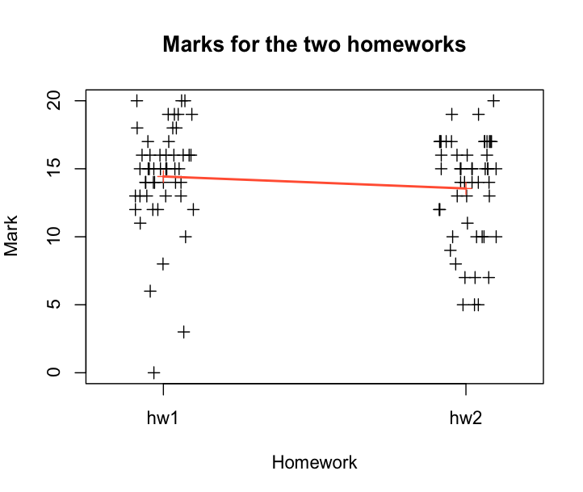
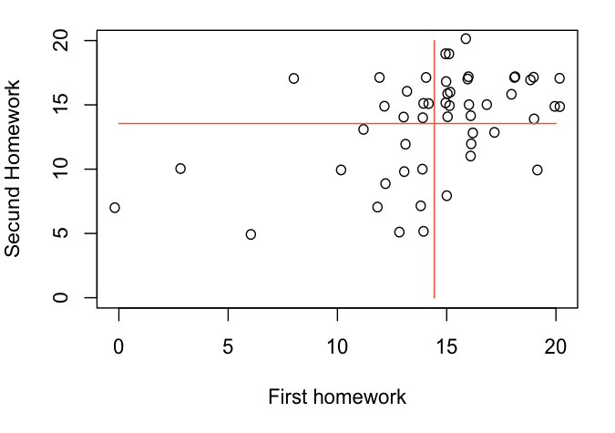
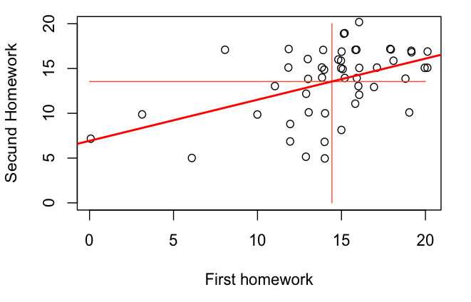

# Statistical inference applied on students marks

## Variables

- Mark : numerical continuous on [0;20]
- Homework : dichotomous : hw1, hw2

## Distribution

Univariate crossed distribution with each student taking both homework subjects.

Formula : `S51*M2`

102 observations for 51 subjects
All 51 subjects take both M1 and M2

There should be interferences between both activities.

## Overview of the dataset

```r
  > marks <- read.csv(file="marks-data.csv",head=T,sep=";")

  > str(marks)
  'data.frame': 102 obs. of  2 variables:
   $ homework: Factor w/ 2 levels "hw1","hw2": 1 1 1 1 1 1 1 1 1 1 ...
   $ mark    : int  16 15 18 17 16 6 16 13 16 20 ...
  > summary(marks)
   homework      mark      
   hw1:51   Min.   : 0.00  
   hw2:51   1st Qu.:12.25  
            Median :15.00  
            Mean   :13.99  
            3rd Qu.:16.75  
            Max.   :20.00  
```

## Descriptive statistics measures

```r
  > firstHomework <- subset(marks, homework == 'hw1')
  > secundHomework <- subset(marks, homework == 'hw2')

  > mean(firstHomework$mark)
  [1] 14.43137
  > mean(secundHomework$mark)
  [1] 13.54902
  > median(firstHomework$mark)
  [1] 15
  > median(secundHomework$mark)
  [1] 15
  > var(firstHomework$mark)
  [1] 15.3702
  > var(secundHomework$mark)
  [1] 15.01255
  > sd(firstHomework$mark)
  [1] 3.920484
  > sd(secundHomework$mark)
  [1] 3.874603
```

## Scatter plot

The following scatter plot compares the marks of the two homeworks, and outlines their means.

```r
  > stripchart(marks$mark~marks$homework, method="jitter", vertical=T, xlab="Homework", ylab="Mark", main="Marks for the two homeworks", pch=3)
  > points(c(mean(firstHomework$mark), mean(secundHomework$mark)), pch=3, col="tomato")
  > lines(c(mean(firstHomework$mark), mean(secundHomework$mark)), pch=3, col="tomato", lwd=2)
```



## Descriptive analysis

Thanks to this data visualization, we see that although the means are similar, the distribution of the marks is different. This difference "jumps to the eyes" : for the first homework, the majority of the marks is comprised between 12 and 20, whereas for the secund one marks are spread between 5 and 20.

## Student's t-test

The student t-test can be applied because we believe the marks to follow a normal distribution. We'll use a t test for a crossed univariate protocol. To check if there is a difference we'll make a two-sided test.

```r
  > t.test(marks$mark~marks$homework,paired=T,alternative="two.sided")

    Paired t-test

  data:  marks$mark by marks$homework 
  t = 1.5624, df = 50, p-value = 0.1245
  alternative hypothesis: true difference in means is not equal to 0 
  95 percent confidence interval:
   -0.2519743  2.0166801 
  sample estimates:
  mean of the differences 
                0.8823529 
```

For 50 degrees of freedom, we obtain `t = 1.5624` and the associated probability `p = 0.1245`. With a 5% threshold, 0.1245 > 0.05 ⇔ p > threshold. We are over the threshold, __thus the difference between the means isn't relevant__ and the null hypothesis « There is a difference between the means » is invalidated.

## Prediction

We'll now look at whether the mark obtained for the first homework predicts the secund mark.

We first create two vectors for each homework.

```r
  > hw1<-marks[marks$homework=="hw1","mark"]
  > hw2<-marks[marks$homework=="hw2","mark"]
```

We then use them to create a scatter plot.

```r
  > plot(jitter(hw1),jitter(hw2), xlab="First homework", ylab="Secund Homework", ylim=c(0,20))
  > lines(c(mean(hw1),mean(hw1)),c(0,20),col="tomato")
  > lines(c(0,20),c(mean(hw2),mean(hw2)),col="tomato")
``



## Linear model

In this analysis, we assume that the first homework's mark helps predicting the secund's. We imply that the first homework was due before the secund one and that this preliminary work has had an impact on the marks.

Because the two variables are numerical, we'll use a linear model to study their relationship.

```r
  > model <- lm(hw2~hw1)
  > coef(model)

  (Intercept)         hw1 
    6.9217227   0.4592285 
```

We thus have `Y = a + bX + e`, or `HW2 = 6.0217227 + 0.4592285 * HW1` + e`

We then add our linear model line to the graph :

```r
  > abline(model, lwd=2, col="red")
```



We then compute an adjusted khi-squared.

```r
  > summary(model)["adj.r.squared"]

  $adj.r.squared
  [1] 0.1999131
```

This 0.19 coefficient means that only 20% of the marks' variation between homeworks is explained by our model. This fifth of explanation may seem small, but we have to keep in mind that there are many parameters to take into account (homeworks' difficulty, student's motivation, etc).
